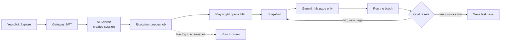

# AI Powered Autonomous Website Testing Platform

**QA writes the journey once in English. The platform walks the live product, saves a real test, and re-runs it after every change — so nobody has to click the same routes by hand again.**

```
Sprint ships a new checkout field.
QA used to: open staging → login → cart → pay → settings → …… every route, every time.
Now:        saved cases → Hit Run → report of what still works.
```

---

## The problem (why I built this)

QA engineers exist to answer one question after every change: **does the product still work on every important path?**

Login, signup, search, cart, billing, settings, admin — these routes do not test themselves. A new feature, a CSS refactor, or a backend tweak can break a screen that nobody touched in that ticket. So QA walks the same flows again. And again. Every sprint.

That manual pass is slow, easy to skip under deadline, and it does not scale as the product grows. Writing Playwright or Selenium by hand *does* automate the clicks, but then QA (or an SDET) spends the time authoring and repairing locators instead of exploring new risk.

**This is the job this project takes over:** turn those repeat journeys into tests you can generate once and run every time something ships.

## How it is used

1. Add the product URL.
2. Describe a flow the way a tester would say it - *“Sign in, open billing, change plan, confirm the success page.”*
3. **Explore** opens a real browser, looks at each page, and records the steps that actually worked.
4. That becomes a saved test case. After the next deploy, **Run** it. A report shows pass / fail with screenshots - the same regression pass, without a human clicking through.

Do this for each critical route. The suite is your smoke/regression pack: new code goes out, the pack runs, QA only digs into what broke.

Manual cases and a faster **Quick AI** generate are still there. Explore is the path meant for real multi-page product flows.

## Why the walk is page-aware

A one-shot “prompt + URL → invent selectors” generator does not solve QA’s problem — those steps fail on the real site, so the engineer is back to clicking.

**What broke in the first design.** Gemini got only the English prompt and the URL. It never opened the browser, so it guessed locators (`#login-btn`, `text=Submit`). Those IDs were often not on the page. After the first click the next screen had never been seen, so every later step was fiction.

**Homepage scrape was still not enough.** Sending Playwright to the first page and dumping its buttons into the prompt is homepage-aware only. “Pick English → search → open result → change this this & this...” needs page 2 and 3 or more. Those locators are not in the first scrape.

**What we do instead — look → decide → act → look again.**


| Typical AI wrapper                      | This system                                                                           |
| --------------------------------------- | ------------------------------------------------------------------------------------- |
| 1 Gemini call for the whole flow        | **1 Gemini call per page** (every action on that page in one batch)                   |
| Selectors guessed from the prompt       | Selectors taken from a **live JPEG + ~80 visible controls** (role, name, placeholder) |
| Next page is fiction                    | Next page is snapshotted **after** the click                                          |
| One call per click (or one giant guess) | Same-page (One or multiple operation) = **one hop** - tokens and time stay bounded    |
| Fail = raw Playwright error             | Walk stops cleanly; **partial steps can still save as a draft**                       |


Playwright always records `navigate` first. Each hop: snapshot → Gemini Vision plans **this page only** → Execution runs the batch. If the URL or a new tab appears mid-batch, remaining steps are dropped (they belonged to the old page). Then a new snapshot. Loop until `done`, `cannot_proceed`, **15 hops**, or **180s**.

What gets saved is what actually ran. That is why **Run** after a release is worth trusting.

---

## The system in numbers


|                                           |                                                                                       |
| ----------------------------------------- | ------------------------------------------------------------------------------------- |
| **6** backend services + React UI         | Auth, AI, Execution, Report, Notify, Gateway                                          |
| **10** containers in one Compose file     | App + Mongo + Redis + RabbitMQ                                                        |
| **1** vision call per page, not per click | Cuts tokens; a login form is fill + fill + submit in one hop                          |
| **15** page hops max                      | Stops wandering                                                                       |
| **180s** walk timeout                     | Hard stop                                                                             |
| **11** Playwright actions                 | navigate, click, fill, hover, press, drag, upload, download, assert, screenshot, wait |
| **7** locator strategies                  | role, label, placeholder, testId, css, xpath, text                                    |


---


## How a page-aware walk works




1. **Frontend** `POST /api/ai/explore` (prompt + URL). Returns in ~1s with a session id - the walk is not finished yet.
2. **AI Service** stores an explore session in Mongo, then tells **Execution** to start.
3. **Execution** (via RabbitMQ) launches Playwright, always records `navigate` first.
4. Each **hop:** JPEG + up to 80 visible controls → Gemini Vision → JSON batch → Playwright. If the URL/tab changes mid-batch, remaining steps are dropped (they were for the old page).
5. Loop until `done`, `cannot proceed`, **15 hops**, or **3 minutes**.
6. **AI Service** writes a TestCase. UI already streamed hops over Socket.io.

**Quick Generate** is still there: one Gemini call, no browser — fine for a rough draft, not for the regression pack.

---


## Stack

React + TypeScript · Node 20 · Express · MongoDB · Redis · RabbitMQ · Playwright · Gemini 2.5 Flash · JWT · Docker Compose

```
Browser ──► Gateway :3000 ──► Auth :3001
                         ├──► AI :3002  ◄── Gemini
                         ├──► Execution :3003  ◄── Playwright + queue
                         ├──► Report :3004
                         └──► Notify :3005  ──► live Socket.io
```

---


## Run it

Needs Docker and a [Gemini API key](https://aistudio.google.com/apikey). Explore will not start without a real key.

```bash
cp .env.example .env          # put GEMINI_API_KEY in .env
docker compose up --build
```

Open **[http://localhost](http://localhost)** → register → project → website URL → **Test Cases** → **Generate with AI** → leave **Walk the live site** on → **Explore & Generate**.


|                 |                                                                      |
| --------------- | -------------------------------------------------------------------- |
| App             | [http://localhost](http://localhost)                                 |
| API             | [http://localhost:3000/api](http://localhost:3000/api)               |
| RabbitMQ        | [http://localhost:15672](http://localhost:15672) (`guest` / `guest`) |
| Mongo (Compass) | `localhost:27018`                                                    |


Without Docker: `npm install && npm run build --workspace=@platform/shared && npm run dev:local` → UI at [http://localhost:5173](http://localhost:5173).

---

## What you can do in the product

- **Explore** — agent walks the site; live hop log + current snapshot
- **Quick AI** — prompt-only generation
- **Manual** — write steps yourself
- **Run** — headless or live Chrome, abort, retry
- **Reports** — step logs, screenshots, JSON download, analytics
- **Auth** — JWT + refresh; every logged-in user has the same access

---

## Repo

```
packages/shared          types, validators, locator normalize
services/ai-service      generate, explore session, next-batch
services/execution-service   Playwright run + walk loop
services/auth-service
services/report-service
services/notification-service
services/api-gateway
frontend
docker-compose.yml       project name: awtp  (awtp-ai, awtp-execution, …)
```

`npm test` runs workspace tests.

Compose knobs: `PLAYWRIGHT_HEADLESS`, `MAX_EXPLORE_HOPS=15`, `EXPLORE_TIMEOUT_MS=180000`.